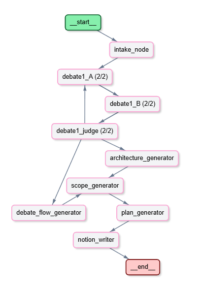

# Adversarial Project Planner 

Adversarial Project Planner is a multi-agent AI system built with **LangGraph** that transforms a vague project description into a structured, production-ready project plan. It uses an "adversarial debate" pattern to stress-test technical decisions before generating the final documentation in Notion.

## Pipeline Overview

The system follows a sophisticated pipeline to ensure high-quality project planning:

1.  **Intake Agent**: Extracts project goals, timelines, and constraints. Uses Human-in-the-loop (HITL) interrupts to ask for missing information.
2.  **Adversarial Debate**: Two agents (`llama-3.1-8b`) debate technical architecture and trade-offs. The debate takes into account your specific project constraints. However, if a constraint is technically unsound or suboptimal, the agents will challenge it, potentially discarding it in favor of a better alternative while providing a clear explanation of why.
3.  **The Judge**: Another model (`llama-3.3-70b-versatile`) evaluates the debate, decides on the winning stack, or orders another round if more clarity is needed.
4.  **Content Generation**: Specialized generators (`gemini-2.5-flash`) create detailed architectural, scope, and plan documentation based on the debate's outcome.
5.  **Multi-Page Notion Export**: The results are automatically written to a structured workspace in Notion.



## LLM selection

| Phase | Model | Reason |
| :--- | :--- | :--- |
| **Debaters** | `llama-3.1-8b-instant` | **Speed & Agility**: We need fast responses for iterative debate rounds without sacrificing basic reasoning. |
| **Judge** | `llama-3.3-70b-versatile` | **Authority**: A more powerful llm that has the authority to decide which agent won the debate. |
| **Generators** | `gemini-2.5-flash` | **Large Context**: Ideal for synthesizing the entire debate history and project context into long-form documentation. |

## Installation

1.  **Clone the repository**:
    ```bash
    git clone 
    cd Adversarial_Project_Planner
    ```

2.  **Set up the environment**:
    Create a `.env` file from the provided example:
    ```bash
    cp .env.example .env
    ```
    Fill in your API keys for Groq, Google (Gemini), Notion, and Langfuse.

3.  **Install dependencies**:
    ```bash
    # Create a virtual environment
    python -m venv venv

    # Activate it (Windows)
    .\venv\Scripts\activate
    # OR Activate it (Mac/Linux)
    source venv/bin/activate

    pip install -r requirements.txt
    ```

## Requirements

- Python 3.10+
- **Groq API Key** (for Llama models)
- **Google AI API Key** (for Gemini)
- **Notion Integration Token** and a Parent Page ID.
- **Langfuse Account**.

## Usage

Run the main script to start the interactive planner:

```bash
python main.py
```

The intake agent will prompt you for details. If mandatory information (like timeline or goal) is missing, it will pause and ask for clarification.

## Langfuse: Observability & Scoring

**Langfuse** is used for full-stack observability. 
- **Tracing**: Every run is traced with the `CallbackHandler`. You can view the entire decision tree, LLM latency, and token usage.
- **Manual Scoring**: After each debate, the system automatically sends scores to Langfuse to evaluate the quality of Agent A and Agent B's arguments, as well as the number of rounds required to reach a consensus.
- **Session Grouping**: Traces are grouped by `session_id` (derived from the project name) for easy analysis of multiple iterations.

## Expected Outcome

The planner automatically creates a hierarchy of pages in your Notion workspace:

```text
📁 [Project Name] — Adversarial Planner
├──  1. Architectural Overview  
│   ├──  Chosen Stack  
│   ├──  System Components  
│   ├──  Key Architectural Decisions  
│   └──  Risks & Mitigations  
├──  2. Scope & Objectives  
│   ├──  Objectives  
│   ├──  MVP Definition  
│   ├──  Out of Scope  
│   └──  Success Criteria  
├──  3. Project Plan  
│   └──  3.1 Full Plan  
│       ├──  Phases  
│       ├──  Milestones (table)  
│       ├──  Time Estimates (table)  
│       └──  Risks (table)  
└──  4. Debate Flow  
    ├──  Debate Flow  
    ├──  Round 1  
    │   ├──  Agent A arguments  
    │   └──  Agent B arguments 
        |_____ Judge Decision (It will ask for another round)
    ├──  Round 2  
    │   ├──  Agent A arguments  
    │   └──  Agent B  
    └──  Judge Decision (winner: A, B or tie)
```


